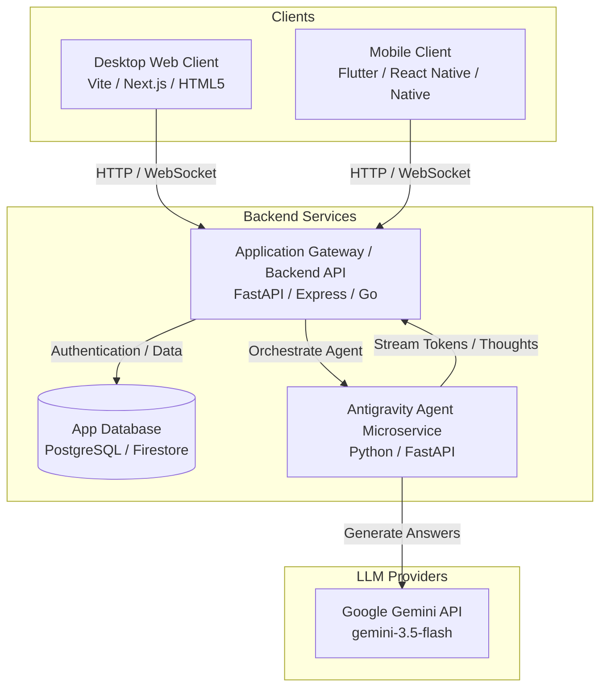

# Plan & Roadmap: AI-Powered Learning Application

This document outlines the strategic plan, system architecture, and phase-by-phase roadmap for developing a modern, cross-platform (Desktop Web & Mobile App) learning application integrated with the Google Antigravity SDK.

---

## 1. System Architecture

To serve both desktop web browsers and native mobile applications securely, we must use a **decoupled, agent-as-a-service** architecture. This prevents API key exposure on client devices and isolates agent orchestration logic.



### Key Components:
1.  **Frontend Clients**:
    *   **Desktop Web**: Optimized for large screens, visual code editors, deep reading layouts, and split-screen tutor interaction.
    *   **Mobile App**: Optimized for touch targets, push notifications, offline study aids, and quick image uploads (e.g., snapping a photo of homework).
2.  **Application Gateway (Main API)**: Handles user authentication, user progress database queries, course management, and JWT validation.
3.  **Antigravity Agent Service (Python)**: Encapsulates the agent workflow. Exposes WebSocket or SSE endpoints to the Gateway to stream thoughts, responses, and tool calls in real-time.

---

## 2. Antigravity Feature Mapping for E-Learning

The Google Antigravity SDK provides specific features that map directly to advanced educational needs:

| Educational Need | Antigravity Feature | Implementation Concept |
| :--- | :--- | :--- |
| **Socratic Tutoring Style (Beginner-Friendly)** | Persona Configurations | Configure `LocalAgentConfig(system_instructions="You are a warm, beginner-friendly Socratic tutor. Use simple terms, explain concepts step-by-step, and avoid jargon...")` |
| **Architecture-First AI Development** | Structured Outputs & Planning | Enforce model structure (Pydantic models) to first output an Architectural Plan (components, data flows) before generating code. |
| **AI Product Decision Framework** | Interactive Flashcards & Quizzes | Quiz users on choosing between simple API calls, RAG, or full Agentic frameworks depending on user constraints. |
| **Automated Quizzes & Grading** | Structured Outputs | Enforce Pydantic schemas on agent output to return formatted JSON quizzes (questions, options, correct answers) for programmatic rendering. |
| **User Memory / Level Tracking** | Stateful Tools (`ToolContext`) | The agent reads/updates student math skill levels, current chapter progress, and quiz history persisted in the `ToolContext` state. |
| **Homework Helper (OCR & Explanations)** | Multimodal Inputs | Students upload a photo of a textbook page or sketch. The agent processes it using `Image.from_file` to offer step-by-step guidance. |
| **Interactive Diagrams** | Multimodal Outputs | The agent dynamically triggers the `GENERATE_IMAGE` tool to create visual analogies for abstract concepts (e.g., "visualize photosynthesis"). |
| **Study Reminders / Triggers** | Periodic Triggers | Configure a background trigger (`every` or file watch) that alerts the student if they have been inactive, sending them a personalized daily review card. |
| **Topic Specialists** | Subagents | Spawns a dedicated "Python Code Debugger" subagent or a "Scientific Calculator" subagent depending on the subject the student is asking about. |

---

## 3. Phase-by-Phase Roadmap

```
Phase 1: Foundation (Weeks 1-4) ──────► Phase 2: Core Web & Agent (Weeks 5-8) 
                                                          │
Phase 4: Launch & Scale (Weeks 13-16) ◄── Phase 3: Mobile & Offline (Weeks 9-12)
```

### Phase 1: Foundation & Architecture (Weeks 1-4)
*   **Deliverables**: API contracts, Database Schema, and local Agent prototypes.
*   **Milestones**:
    *   Initialize database (User accounts, courses, study history tables).
    *   Implement basic Socratic agent scripts using `google-antigravity`.
    *   Establish safety guidelines using `policy.workspace_only` and command denial to secure backend executions.

### Phase 2: Core Web Application & Real-Time Agent (Weeks 5-8)
*   **Deliverables**: Desktop Web Frontend & Streaming Agent Backend.
*   **Milestones**:
    *   Build responsive Desktop dashboard with markdown rendering and interactive chat components.
    *   Deploy FastAPI Agent Backend with WebSocket streaming.
    *   Develop a **Thinking Visualizer** in the frontend, separating the agent's reasoning process (thoughts) from its response bubbles to build user trust.
    *   Implement structured Pydantic output schemas for auto-generating study flashcards.

### Phase 3: Mobile Experience & Offline Features (Weeks 9-12)
*   **Deliverables**: Native-feel Mobile UI (React Native or Flutter) & Push Notifications.
*   **Milestones**:
    *   Configure cross-platform mobile codebase. Establish secure WebSocket connections to the API gateway.
    *   Implement Multimodal image capture (camera upload for homework parsing).
    *   Integrate background triggers to push daily study micro-reminders to mobile notifications.
    *   Build local caching of lessons so students can study text content offline.

### Phase 4: Launch, Scale & Observability (Weeks 13-16)
*   **Deliverables**: Audits, scale tuning, and staging release.
*   **Milestones**:
    *   Implement **Thinking Token Tracking** (`UsageMetadata.thoughts_token_count`) to audit usage costs and prevent runaway loops.
    *   Register lifecycle error hooks to gracefully recover and offer fallback study hints if the model encounters rate limits or validation errors.
    *   Run beta testing with 100+ students. Deploy to production cloud (e.g., GCP App Hosting or Firebase App Hosting).

---

## 4. Documentation, Testing & Deployment Architecture

### A. Documentation Standard
*   **API Open Specs**: Autogenerated Swagger UI docs (FastAPI native `/docs`) detailing schemas and payload parameters.
*   **Code Quality**: Strict docstrings for all custom tools so that the agent can read and comprehend their capabilities.
*   **User Guides**: Documentation explaining agent interactions, Socratic tutoring limits, and cost reporting.

### B. Testing Framework
*   **Unit & Integration Tests**: Using `pytest` and `httpx.AsyncClient` to mock the Gemini API and verify route responses.
*   **Structured Output Auditing**: Validating that generated quizzes strictly conform to the expected Pydantic schema structure.
*   **Load Testing**: Simulating multiple concurrent WebSocket streams to monitor system latency and thread management.

### C. Deployment Pipeline (Golden Path)
*   **Containerization**: Use multi-stage `Dockerfile` builds to minimize size and optimize image load times in container registries.
*   **Cloud Hosting**: Deploy Backend on container orchestration (e.g. AWS ECS, Google Cloud Run, or Kubernetes).
*   **Secret Management**: Securely load keys (`GEMINI_API_KEY`) from environment stores (AWS Secrets Manager, GCP Secret Manager) instead of using configuration files.

---

## 5. AI Product Design & Analysis Decision Framework

The application curriculum teaches beginners a structured step-by-step decision framework when conceptualizing their AI products:

1.  **Feasibility & Need**: Beginners learn to ask: *Is an LLM really needed here, or is a deterministic algorithm better?*
2.  **Architecture Selection**: Helping developers choose between raw API prompting, RAG systems, or full Agentic workflows (Antigravity).
3.  **Security & Regulatory Guardrails**: Choosing between public cloud endpoints, hybrid models, or air-gapped sovereign execution.
4.  **Operational Auditing**: Estimating token budgets, analyzing candidate usage, and planning for model latency.

---

## 6. Mobile UI Development & Backend Integration Steps

Developing a fluid, responsive mobile interface that communicates with the streaming Antigravity backend requires specific state management and connection handling.

### A. Mobile UI Layout & State Management (React Native & Flutter)
*   **Double-Buffer Text Rendering**: Maintain two state streams: `activeThoughts` (collapsible accordion with pulsing brain animation) and `activeResponse` (the main message bubble).
*   **Activity Spinner**: Render a dynamic card highlighting the active tool (e.g. `GENERATE_IMAGE` or `devops_os scaffolding`) while waiting for tool hooks to complete execution.
*   **Camera Integration**: Allow beginners to take pictures of code sheets or architectural sketches, converting the image to base64 or upload URI to send as an `Image` parameter to the backend.

### B. Backend Connection Protocol (WebSockets or Server-Sent Events)
*   **WS Protocol**: Open a WebSocket route to the FastAPI backend.
*   **JSON Frame Parsing**: The backend yields events in the following structure:
    ```json
    { "type": "thought", "data": "Checking schema..." }
    { "type": "token", "data": "To build an app, " }
    { "type": "tool_start", "data": "view_file" }
    { "type": "tool_end", "data": "view_file results" }
    ```
*   **Reconnection Logic**: Mobile connections drop frequently. Implement exponential backoff reconnection on the client to automatically resume the session using the persistent `conversation_id`.

---

## 7. Practical AI for Real Engineering Work (Curriculum)

Drawing from Saravanan Gnanaguru's professional publications and tech logs, the app curriculum emphasizes these key design principles:

1.  **AI-Assisted vs. Agentic AI**: Helping beginners understand the difference between *AI-Assisted Engineering* (where developers manually review AI completions inline) and *Agentic AI* (where the system is empowered with tools and loops to self-correct).
2.  **AI Security & Runtime Guardrails**: Learning to build safe runtime policies (such as dependency checks and command validators) to block malicious prompt injections or unsafe commands.
3.  **Process-First AI-SDLC**: Designing systems where AI actions are gated by quality, unit testing, and architectural reviews.
