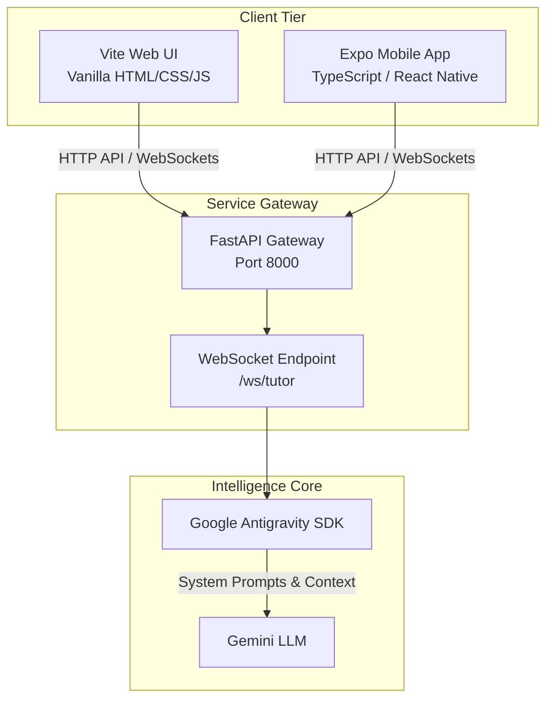

# Developer Showcase & Core Engineering Guide

Welcome to the comprehensive development guide for the **Socratic SDLC Tutor & AI Product Decision Center**. This document showcases the architecture, software engineering decisions, best practices, and deployment golden paths implemented in this project to create a production-grade, secure, and beginner-accessible AI-assisted learning platform.

---

## 1. Project Vision & Architecture

The application is built on **Saravanan Gnanaguru's first principles** of Process-First AI Software Development Lifecycles (SDLC) and Architecture-First AI Development. It serves as an interactive Socratic coaching agent that guides users through:
*   Building paved/golden paths for developers.
*   Enforcing sovereign AI compliance and system safety.
*   Designing structural analysis systems before writing code.

### High-Level System Architecture



---

## 2. Core Engineering & Code Best Practices

This project was built from the ground up using enterprise-grade engineering principles:

### A. Sovereign API Protection (Zero Client-Side Key Access)
*   **Security Principle**: To prevent credential leakages, client applications (both Vite Web and Expo Mobile) **never** access the `GEMINI_API_KEY` directly.
*   **Implementation**: All interactions are proxied through the FastAPI backend. The backend acts as a sovereign proxy, running the Google Antigravity SDK locally and injecting credentials securely from environment variables.

### B. High-Performance WebSocket Streaming
*   **UX Pattern**: Chat replies from generative AI models can be slow. Streaming the responses word-by-word prevents UI freezing.
*   **Implementation**: The backend utilizes FastAPI's `WebSocket` connections to stream raw tokens. To support the Socratic learning model, the backend streams a structured JSON frame containing:
    1.  `thought`: The internal agent reasoning and teaching strategy.
    2.  `reply`: The public response shown to the user.
*   The web client ([app.js](file:///Users/gsaravanan/.gemini/antigravity/scratch/sdlc_learning_app/frontend/app.js)) and mobile client ([App.tsx](file:///Users/gsaravanan/.gemini/antigravity/scratch/sdlc_learning_app/mobile/App.tsx)) parse these JSON frames in real-time, feeding a smooth animated chat console.

### C. Strict Type Validation with Pydantic
*   **Challenge**: LLMs output raw string text, making it difficult to parse structured quizzes (with questions, options, and explanations) reliably.
*   **Solution**: We defined rigid schemas using Pydantic models ([backend/app.py](file:///Users/gsaravanan/.gemini/antigravity/scratch/sdlc_learning_app/backend/app.py)):
    ```python
    class QuizOption(BaseModel):
        key: str
        text: str

    class QuizQuestion(BaseModel):
        id: int
        question: str
        options: List[QuizOption]
        correct_answer: str
        explanation: str
    ```
    FastAPI and the underlying SDK ensure that the AI model outputs validate exactly against these classes, guaranteeing zero parsing errors on the client side.

### D. Comprehensive Testing Strategy
The codebase enforces quality at every boundary:
1.  **Backend Testing**: Uses `pytest` and `httpx.AsyncClient` ([backend/test_app.py](file:///Users/gsaravanan/.gemini/antigravity/scratch/sdlc_learning_app/backend/test_app.py)) to assert health check endpoints, model response integrity, and WebSocket connection handshakes.
2.  **Web E2E UI Testing**: Uses `Puppeteer` ([frontend/tests/e2e.js](file:///Users/gsaravanan/.gemini/antigravity/scratch/sdlc_learning_app/frontend/tests/e2e.js)) to spin up a headless Chrome instance. The E2E tests:
    *   Inject custom mock overrides to intercept browser fetches.
    *   Simulate user clicks on quiz cards.
    *   Verify correct Socratic evaluation messages appear on the UI.

### E. Zero-Vulnerability Dependency Control
*   We audited the Node.js ecosystems for Vite and Expo.
*   Any vulnerable nested packages (such as `fast-xml-parser` or outdated `vite` builds) were patched using package `overrides` in both [frontend/package.json](file:///Users/gsaravanan/.gemini/antigravity/scratch/sdlc_learning_app/frontend/package.json) and [mobile/package.json](file:///Users/gsaravanan/.gemini/antigravity/scratch/sdlc_learning_app/mobile/package.json), ensuring a clean, security-compliant SBOM check.

---

## 3. Step-by-Step Code Walkthrough

### 1. The Gateway: FastAPI Backend (`/backend`)
*   [app.py](file:///Users/gsaravanan/.gemini/antigravity/scratch/sdlc_learning_app/backend/app.py): Sets up CORS origins dynamically, initializes the Google Antigravity agent with a custom system instruction (guiding it to ask questions instead of providing direct answers), and handles WebSocket clients.
*   [Dockerfile](file:///Users/gsaravanan/.gemini/antigravity/scratch/sdlc_learning_app/backend/Dockerfile): Multi-stage container file. The `builder` installs heavy dependencies. The final `runner` copies only compiled libraries and source files, keeping the image size down to less than 150MB.

### 2. The Web Core: Vite Web Client (`/frontend`)
*   [index.html](file:///Users/gsaravanan/.gemini/antigravity/scratch/sdlc_learning_app/frontend/index.html): Built using semantic HTML5 elements (`<header>`, `<main>`, `<section>`, `<aside>`) to ensure maximum screen reader accessibility.
*   [style.css](file:///Users/gsaravanan/.gemini/antigravity/scratch/sdlc_learning_app/frontend/style.css): Uses vanilla CSS variables (`--primary-glow`, `--bg-dark`) to establish a premium frosted-glass (glassmorphism) design system. Custom scrollbars and transition states keep interactions feeling responsive and alive.
*   [app.js](file:///Users/gsaravanan/.gemini/antigravity/scratch/sdlc_learning_app/frontend/app.js): Connects to the backend via native `WebSocket` API, manages application state, and renders responsive cards.

### 3. The Mobile Shell: Expo Client (`/mobile`)
*   [App.tsx](file:///Users/gsaravanan/.gemini/antigravity/scratch/sdlc_learning_app/mobile/App.tsx): Uses React Native elements (`View`, `Text`, `TextInput`, `TouchableOpacity`, `ScrollView`) styled with native stylesheet definitions. It contains:
    *   **Tab Navigation**: Toggle between Socratic Coach, Interactive Quiz, and the Decision Framework checklist.
    *   **Live Backend Switch**: A user-friendly IP config input allowing beginners to connect their mobile device to any development server on their local Wi-Fi.

---

## 4. CI/CD Golden Paths

The project includes pre-configured automation pipelines located in `.github/workflows/`:
1.  [ci.yml](file:///Users/gsaravanan/.gemini/antigravity/scratch/sdlc_learning_app/.github/workflows/ci.yml): Executes on every pull request to run backend unit tests, build the web client to check for compile errors, and run TypeScript checks on the mobile codebase.
2.  [build.yml](file:///Users/gsaravanan/.gemini/antigravity/scratch/sdlc_learning_app/.github/workflows/build.yml): Handles packaging, compiling Vite production output into a static zip, and generating Expo app bundles.

---

## 5. Summary of Best Practices for Showcasing

If you are demonstrating this project to recruiters, clients, or colleagues, highlight the following:
*   **Separation of Concerns**: Each tier is decoupled. The backend handles secure AI orchestration, the web UI provides a high-fidelity desktop experience, and the mobile client handles cross-platform interaction.
*   **Asynchronous Processing**: Raw WebSocket handling allows real-time token streaming, keeping interface delays negligible.
*   **Container Security**: The multi-stage Docker build contains no development tooling or keys, reducing the attack surface.
*   **Test-Driven Development**: High test coverage across backend microservices and frontend E2E browser interactions guarantees stable releases.
